# 📊 Business Insights Report (Exploratory Data Analysis)

## 📌 Project Overview

This project performs **Exploratory Data Analysis (EDA)** on a Marketing Campaign dataset to understand customer behavior, spending patterns, and marketing campaign performance. The analysis includes data cleaning, statistical exploration, data visualization, and business recommendations.

---

## 🎯 Objective

- Perform Exploratory Data Analysis (EDA)
- Clean and preprocess the dataset
- Analyze customer demographics and purchasing behavior
- Visualize important trends and patterns
- Generate business insights and recommendations

---

## 🛠️ Tools & Technologies

- Python
- Pandas
- Matplotlib
- Seaborn
- Jupyter Notebook
- VS Code

---

## 📂 Dataset

**Marketing Campaign Dataset**

The dataset contains customer demographic information, purchasing history, and marketing campaign responses.

---

## 📋 Project Workflow

### 1. Data Loading
- Imported dataset using Pandas
- Verified dataset dimensions
- Displayed dataset preview

### 2. Data Cleaning
- Checked missing values
- Removed duplicate records
- Filled missing values in the `Income` column using the median

### 3. Exploratory Data Analysis
- Statistical summary
- Age distribution
- Income distribution
- Education analysis
- Marital status analysis
- Product purchase analysis
- Campaign response analysis
- Correlation analysis

### 4. Business Insights
- Customer spending analysis
- Customer segmentation
- Marketing campaign performance
- Product preference analysis

---

# 📸 Project Screenshots

## Dataset Preview

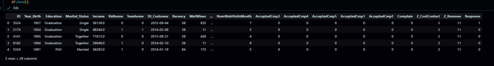

---

## Dataset Information

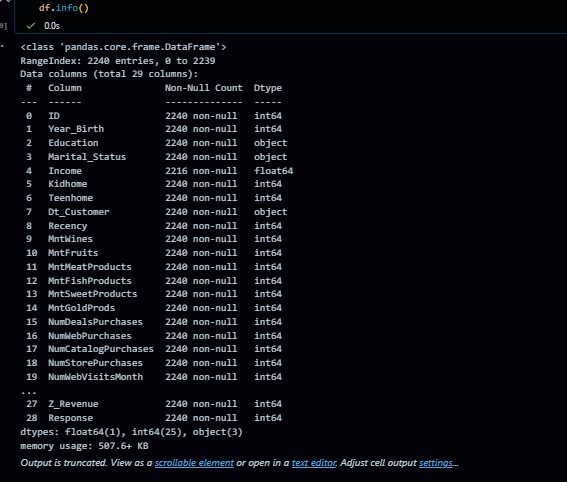

---

## Dataset Shape


---

## Descriptive Statistics

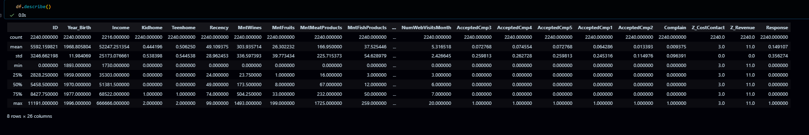

---

## Missing Values

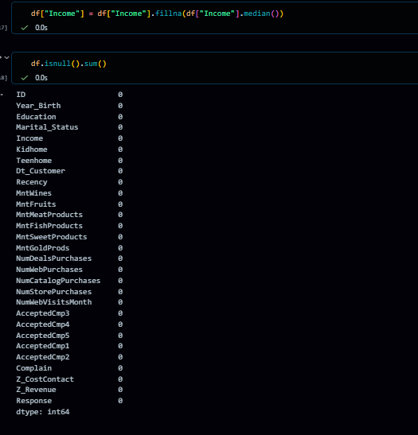

---
## Dataset Columns

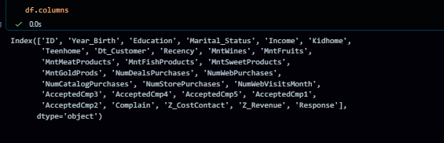

---
## Duplicate Records

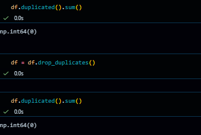

---

## Age Distribution

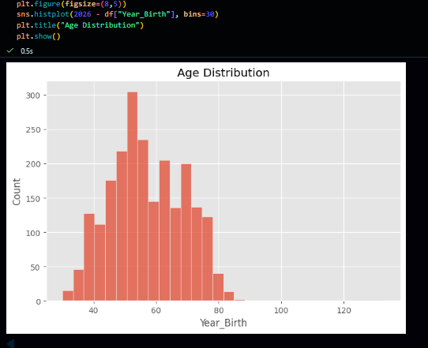

---

## Income Distribution

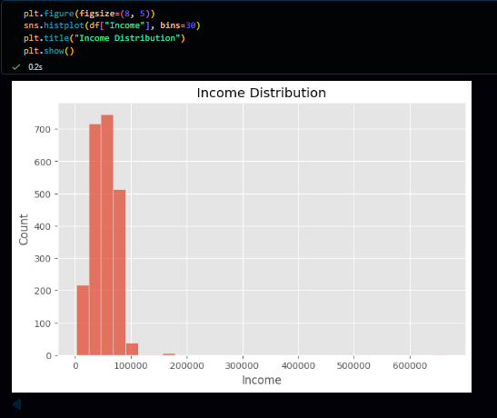

---

## Education Distribution

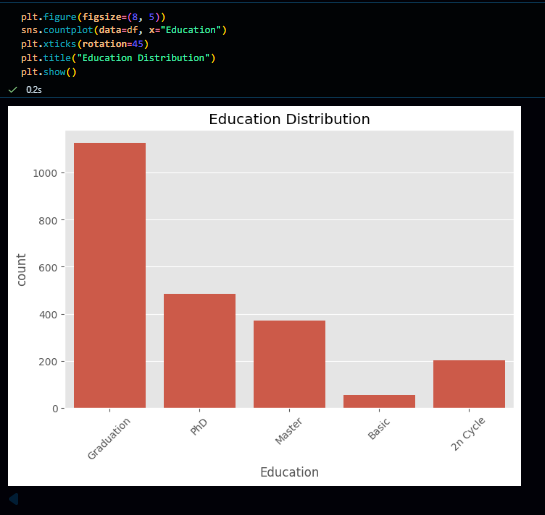

---

## Marital Status

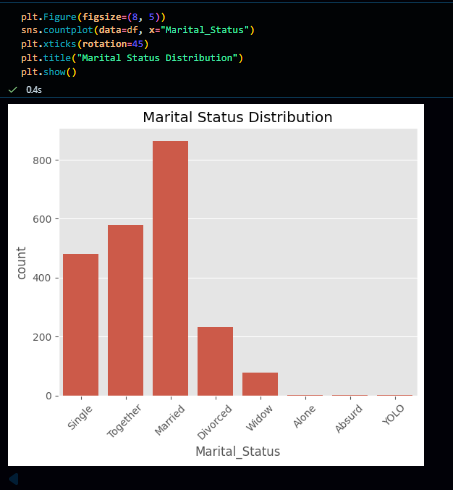

---

## Wine Purchase Distribution


---

## Campaign Response

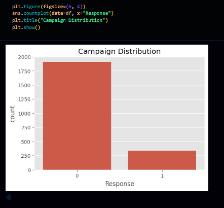

---

## Total Purchase Distribution

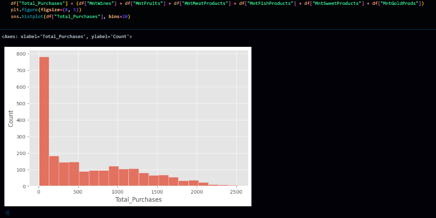

---

## Correlation Heatmap

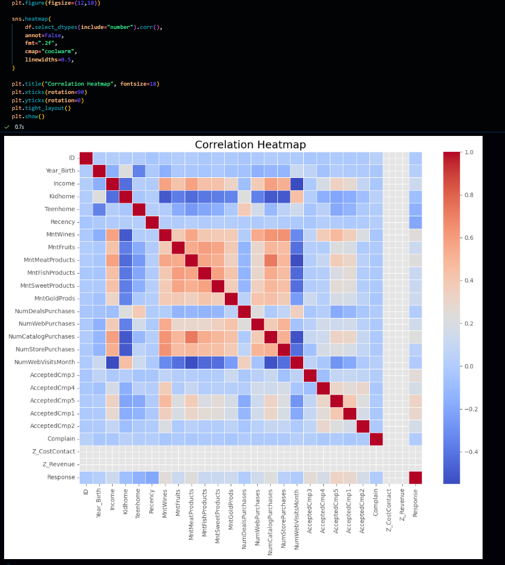

---

# 📈 Key Business Insights

- Customers with higher income generally spend more across product categories.
- Wine products contribute the highest customer expenditure.
- Most customers did not respond positively to the marketing campaigns.
- Married customers represent one of the largest customer groups.
- Spending across different product categories is positively correlated.
- Data cleaning improved dataset quality by handling missing values and removing duplicate records.

---

# 💡 Business Recommendations

- Focus premium marketing campaigns on high-income customers.
- Improve campaign targeting to increase response rates.
- Offer personalized promotions based on customer purchase history.
- Increase promotional efforts for underperforming product categories.
- Use customer segmentation to improve marketing effectiveness.

---

# 📁 Repository Structure

```
SCT_DA_4/
│
├── marketing_campaign.csv
├── task4.ipynb
├── README.md
├── Business_Insights_Report.pdf
│
└── Screenshots/
    ├── dataset_preview.png
    ├── dataset_info.png
    ├── dataset_shape.png
    ├── descriptive_statistics.png
    ├── missing_values.png
    ├── duplicate_records.png
    ├── age_distribution.png
    ├── income_distribution.png
    ├── education_distribution.png
    ├── marital_status.png
    ├── wine_purchase_distribution.png
    ├── campaign_response.png
    ├── total_purchase_distribution.png
    └── correlation_heatmap.png
```

---

# 👨‍💻 Skills Demonstrated

- Exploratory Data Analysis (EDA)
- Data Cleaning & Preprocessing
- Data Visualization
- Business Intelligence
- Customer Behavior Analysis
- Correlation Analysis
- Python Programming
- Pandas
- Matplotlib
- Seaborn

---

## 📜 Internship

**SkillCraft Technology – Data Analytics Internship**

**Task 4:** Business Insights Report (Exploratory Data Analysis)

---

⭐ If you found this project useful, consider giving it a star on GitHub!
